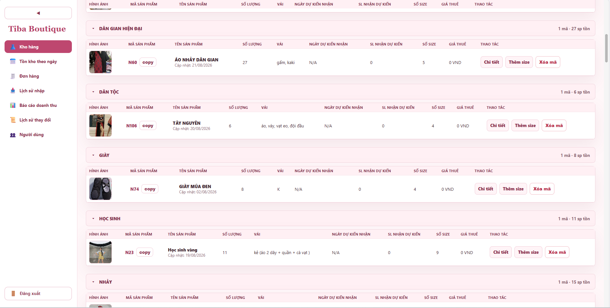
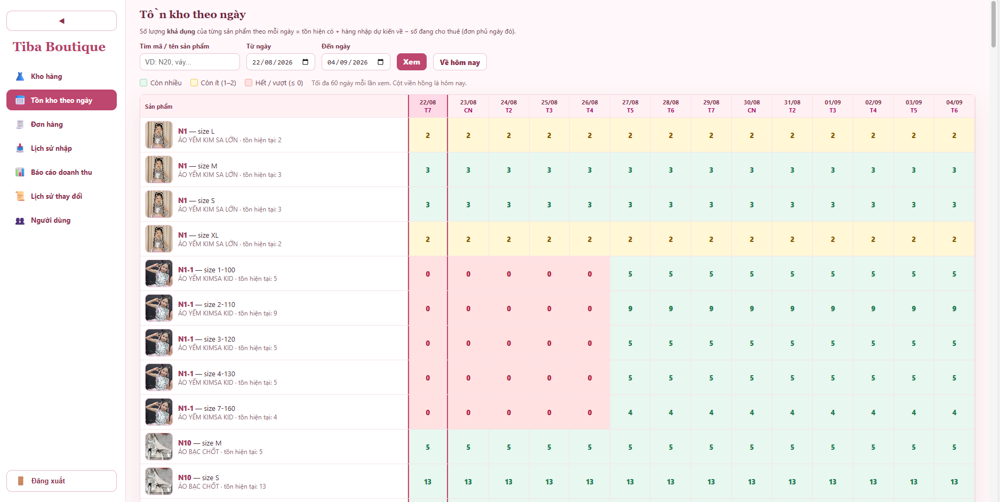
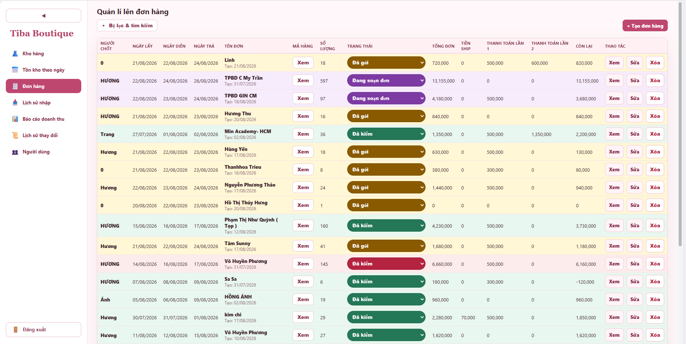
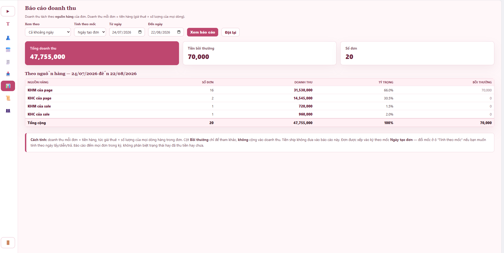
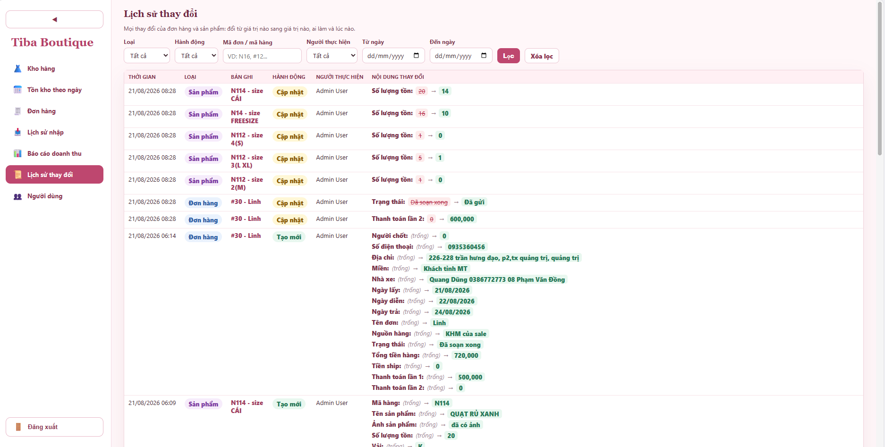

# Tiba Boutique Store

Ứng dụng web quản lí **kho hàng và cho thuê trang phục** cho cửa hàng thời trang/biểu diễn, xây dựng bằng **Laravel 9**. Hệ thống theo dõi tồn kho theo từng mã–size, lên đơn cho thuê theo lịch lấy/diễn/trả, tính doanh thu theo nguồn khách và ghi lại toàn bộ lịch sử thay đổi.

Giao diện tông hồng boutique, điều hướng bằng **sidebar bên trái**, tối ưu cho thao tác nhập liệu nhanh hằng ngày.

---

## Giao diện

**Kho hàng** — sản phẩm nhóm theo danh mục, mỗi mã gồm nhiều size, có hình ảnh, giá thuê, tồn hiện tại và hàng nhập dự kiến.



**Tồn kho theo ngày** — ma trận số lượng *khả dụng* của từng mã–size theo mỗi ngày; ô xanh còn nhiều, vàng còn ít, đỏ hết/vượt. Cột hôm nay viền hồng.



**Đơn hàng** — bảng đơn với người chốt, lịch lấy/diễn/trả, trạng thái (màu theo trạng thái), tổng đơn, tiền ship, thanh toán nhiều lần và số còn lại. Có bộ lọc & tìm kiếm.



**Báo cáo doanh thu** — tổng doanh thu, tiền bồi thường và số đơn trong kỳ; tách theo nguồn hàng (KHM/KHC của page/sale) kèm tỷ trọng. Chọn mốc tính theo ngày tạo/lấy/diễn/trả.



**Lịch sử thay đổi** — nhật ký mọi thay đổi của đơn hàng và sản phẩm: đổi từ giá trị nào sang giá trị nào, ai làm, lúc nào. Lọc theo loại, hành động, mã đơn/mã hàng, người thực hiện và khoảng thời gian.



---

## Chức năng chính

### Kho hàng
- Mỗi dòng kho là một cặp **mã + size** (không trùng). Một mã có thể gồm nhiều size.
- Thông tin theo mã: tên, hình ảnh, vải, **danh mục**, **giá thuê**.
- Thông tin theo size: số lượng tồn, ngày dự kiến nhận và số lượng nhận dự kiến.
- Nhóm hiển thị theo **danh mục**, có nút gom/xổ; nút **copy** để nhân bản nhanh một mã.
- Sửa thông tin theo **toàn mã** hoặc **riêng từng size**.
- Tìm kiếm theo mã/tên, sắp xếp, phân trang.

### Chi tiết & theo dõi sản phẩm
- Xem các đơn hàng liên quan tới một mã–size.
- Biểu đồ biến động tồn kho dự kiến theo thời gian.

### Tồn kho theo ngày
- Ma trận sản phẩm × ngày cho toàn kho.
- Số **khả dụng** mỗi ngày = tồn hiện có + hàng nhập dự kiến về − số đang cho thuê (đơn phủ ngày đó).
- Lọc theo mã/tên và khoảng ngày (tối đa 60 ngày).

### Lịch sử nhập kho
- Tự ghi nhận khi tạo sản phẩm có tồn ban đầu hoặc khi tăng tồn: số lượng nhập, tồn trước, tồn sau, người nhập.

### Đơn hàng
- Thông tin chung: người chốt, **số điện thoại**, **địa chỉ**, **miền**, **nhà xe**, tên đơn, lịch **lấy / diễn / trả**, **nguồn hàng**.
- Nhiều dòng hàng; cho phép **cùng một mã với nhiều giá thuê khác nhau** (thuê bộ / thuê lẻ), **ghi chú theo từng size**, và size **"Chưa chốt"** cập nhật sau.
- **Giá thuê sửa được ngay trên đơn** mà không ảnh hưởng giá thuê gốc trong kho.
- Tiền: tổng tiền hàng (giá thuê × số lượng), **tiền ship**, **thanh toán lần 1 / lần 2**, **tiền bồi thường**, số **còn lại**.
- Cảnh báo **vượt tồn** khi chọn ngày lấy, báo rõ mã nào, size gì, vượt bao nhiêu trong khoảng ngày nào.
- **Tự lưu nháp** khi đang tạo đơn mới (khôi phục lại nếu lỡ tải lại trang).
- Bộ lọc đầy đủ và tìm theo tên người đặt/tên đơn.

### Trạng thái đơn & thanh toán
- Trạng thái đơn: `Chưa cho size` → `Đã in đơn lên file` → `Đã in đơn ra giấy` → `Đang soạn đơn` → `Đã soạn xong` → `Đã gửi` → `Đã trả về` → `Đã kiểm`.
- Trạng thái thanh toán: `Cọc`, `Thanh toán lần 1`, `Thanh toán lần 2`, `Còn lại`.
- Khi chuyển sang `Đã kiểm`, nếu số lượng trả về không khớp thì bôi đỏ và cho nhập **tiền bồi thường** + ghi chú kiểm đơn.

### Báo cáo doanh thu
- Tổng doanh thu, tiền bồi thường, số đơn trong kỳ.
- Tách theo **nguồn hàng** (KHM/KHC của page, KHM/KHC của sale) kèm tỷ trọng.
- Chọn mốc tính theo ngày tạo/lấy/diễn/trả.

### Lịch sử thay đổi (nhật ký)
- Ghi lại mọi thay đổi của đơn hàng và sản phẩm ở dạng *trước → sau*, kèm người thực hiện và thời điểm.
- Lọc theo loại (đơn/sản phẩm), hành động (tạo mới/cập nhật), mã, người thực hiện và khoảng ngày.

### Nhắc đơn đến ngày
- Khi đăng nhập, hệ thống nhắc:
  - Đơn đến **ngày lấy** → gợi ý chuyển trạng thái xử lý tiếp.
  - Đơn đến **ngày trả** → gợi ý tất toán.
- Mỗi nhắc việc có thể xác nhận, chọn **Không nhắc lại**, hoặc **Để sau**.

### Người dùng
- Đăng nhập bằng mã đăng nhập + mật khẩu.
- Phân quyền **admin** / **cộng tác viên**; quản lí người dùng dành cho admin.

---

## Công nghệ

- **Laravel 9** (PHP `^8.0.2`), Blade, Eloquent.
- **MySQL / MariaDB**.
- Giao diện thuần Blade + CSS (không cần build front-end).
- Khuyến nghị **XAMPP** khi chạy trên Windows.

---

## Yêu cầu môi trường

- PHP `^8.0.2`
- Composer
- MySQL hoặc MariaDB
- Git
- XAMPP (khuyến nghị trên Windows)

---

## Cài đặt

Clone mã nguồn:

```bash
git clone https://github.com/nminhcuongdev/tibastore.git
cd tibastore
```

Cài dependency PHP:

```bash
composer install
```

Tạo file môi trường:

```bash
cp .env.example .env
```

Trên Windows/PowerShell:

```powershell
Copy-Item .env.example .env
```

Tạo app key:

```bash
php artisan key:generate
```

> Nếu `php` chưa có trong PATH khi dùng XAMPP, thay `php` bằng đường dẫn PHP của XAMPP, ví dụ `C:\xampp\php\php.exe`.

---

## Cấu hình database

Tạo database:

```sql
CREATE DATABASE tibastore CHARACTER SET utf8mb4 COLLATE utf8mb4_unicode_ci;
```

Cập nhật `.env`:

```env
DB_CONNECTION=mysql
DB_HOST=127.0.0.1
DB_PORT=3306
DB_DATABASE=tibastore
DB_USERNAME=root
DB_PASSWORD=
```

Chạy migration (và seed dữ liệu mẫu nếu cần), tạo symlink cho ảnh:

```bash
php artisan migrate
php artisan db:seed
php artisan storage:link
```

Tài khoản đăng nhập mẫu (nếu chạy seeder):

```text
Mã đăng nhập: admin
Mật khẩu: password
```

> Nếu bạn có sẵn file SQL dump, có thể import trực tiếp vào database `tibastore` thay cho `migrate`/`db:seed`.

---

## Chạy ứng dụng

```bash
php artisan serve
```

Trên Windows với XAMPP:

```powershell
C:\xampp\php\php.exe artisan serve --host=127.0.0.1 --port=8000
```

Mở trình duyệt:

```text
http://127.0.0.1:8000/login
```

---

## Mô hình tồn kho theo đơn hàng

- Đơn ở các trạng thái đầu (chưa gửi): **chưa trừ kho**.
- Khi đơn ở trạng thái **`Đã gửi`** hoặc **`Đã trả về`**: hệ thống **trừ tồn** theo số lượng của đơn. Nếu không đủ, báo lỗi và không cho chuyển.
- Khi đơn về **`Đã kiểm`**: **hoàn** số lượng về kho.
- Nếu đơn đang trừ kho mà sửa mã hàng/số lượng: hệ thống tự đồng bộ lại tồn theo phần chênh lệch.
- Tồn *khả dụng* dùng cho cảnh báo và cho màn hình "Tồn kho theo ngày" còn tính thêm **hàng nhập dự kiến** và **các đơn gối ngày**.

---

## Triển khai tự động (shared hosting / cPanel)

Repo có sẵn `deploy.sh` để tự kéo code và cập nhật ứng dụng, chạy định kỳ bằng **cron**:

- Chỉ chạy khi có **commit mới** (dùng file đánh dấu), tránh phình log và xoá cache không cần thiết.
- Kéo code → xoá cache config/route → `migrate --force` → `route/config/view/cache:clear`.
- Tự dò PHP CLI `>= 8.0.2` phù hợp trên hosting (ea-php / alt-php / `/usr/local/bin/php`).

Ví dụ dòng cron (mỗi 5 phút):

```bash
*/5 * * * * /home/<user>/tibastore/deploy.sh >> /home/<user>/deploy.log 2>&1
```

---

## Một số lệnh hữu ích

```bash
php artisan migrate       # chạy migration mới
php artisan db:seed       # chạy lại seed
php artisan view:clear    # xoá cache view
php artisan route:list    # xem danh sách route
```

---

## Đẩy code lên GitHub

```bash
git status
git add .
git commit -m "Cập nhật tài liệu dự án"
git push origin main
```

Remote hiện tại:

```text
https://github.com/nminhcuongdev/tibastore.git
```
